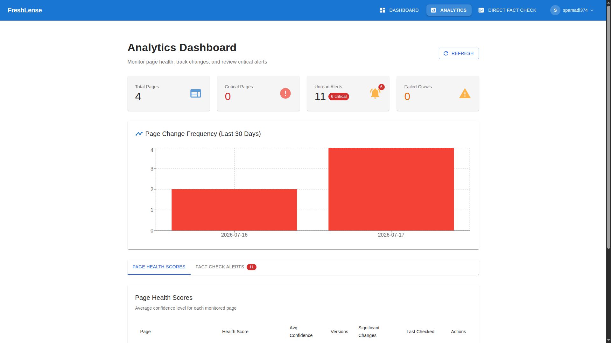
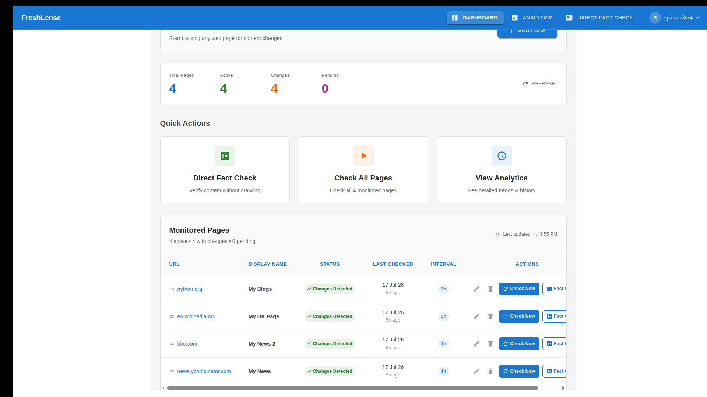
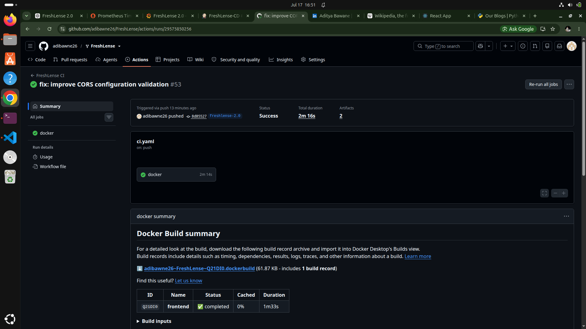
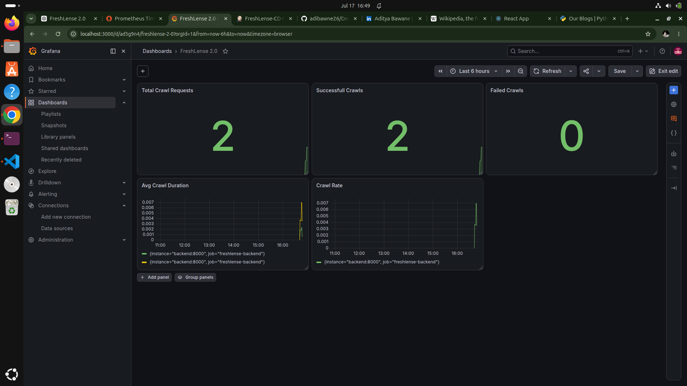
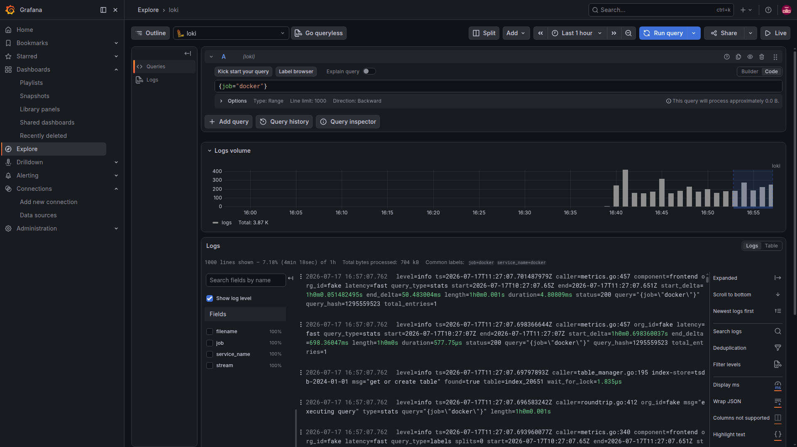

# 🚀 FreshLense 2.0

### AI-Powered Content Freshness Monitoring Platform

> **Infrastructure Monitoring & Deployment Intelligence for Modern Cloud-Native Systems**

FreshLense 2.0 is a production-grade content freshness monitoring platform that combines intelligent web content tracking with modern DevOps practices. The platform continuously monitors websites, detects meaningful content changes, generates AI-powered summaries, and provides real-time observability through an end-to-end cloud-native deployment pipeline.

---


---

## 🌐 Live Demo

**Application:** *(Coming Soon - HTTPS Deployment)*

**Production Server:** `http://16.112.69.27`

---

# 📖 Project Overview

FreshLense 2.0 is an AI-powered content freshness monitoring platform designed to intelligently monitor websites, detect meaningful content changes, and provide actionable insights through automated analysis and production-grade observability.

Unlike traditional website monitoring tools that only verify service availability (uptime), FreshLense focuses on **content intelligence**. The platform continuously crawls web pages, identifies significant content modifications, maintains historical versions, generates AI-powered summaries, and performs automated fact-checking to help users quickly understand what has changed and why it matters.

Beyond the application itself, FreshLense was engineered as a **production-ready cloud-native project** to demonstrate modern DevOps practices. The platform features a fully automated CI/CD pipeline, containerized deployment, centralized logging, real-time monitoring, infrastructure security, automated backups, and cloud deployment on AWS.

This project demonstrates the complete software delivery lifecycle, from application development to automated production deployment and operational monitoring.

---

## 🎯 Problem Statement

Organizations, researchers, developers, and businesses often rely on websites whose content changes frequently.

Examples include:

- Product documentation
- Government notifications
- Research publications
- Company announcements
- Technical blogs
- Regulatory updates
- News articles

Traditional monitoring tools can notify users when a website becomes unavailable, but they rarely explain **what actually changed**.

FreshLense solves this problem by continuously tracking web content, storing historical versions, identifying meaningful differences, generating intelligent summaries, and presenting change analytics through an intuitive dashboard.

---

## 💡 Key Objectives

- Monitor dynamic web content automatically
- Detect meaningful content changes
- Generate AI-assisted summaries of updates
- Maintain historical page versions
- Provide analytics and change insights
- Automate deployment through CI/CD
- Deliver production-grade monitoring and observability
- Demonstrate modern DevOps best practices

---

# ✨ Core Features

## 🌐 Intelligent Web Content Monitoring

- Continuous monitoring of web pages for content changes
- Smart change detection using content comparison
- Historical version tracking and change history
- Configurable monitoring intervals
- Support for tracking multiple websites simultaneously

---

## 🤖 AI-Powered Content Intelligence

- AI-generated summaries of detected changes
- Semantic analysis of content modifications
- Intelligent change significance scoring
- Automated fact-checking integration
- Context-aware content analysis

---

## 📊 Analytics Dashboard

- Interactive dashboard with monitoring statistics
- Content freshness analytics
- Historical change visualization
- Page activity insights
- Real-time monitoring status

---

## 🔐 Secure Authentication

- JWT-based authentication
- Multi-Factor Authentication (MFA)
- Email verification
- Password reset functionality
- Secure session management
- Audit logging for security events

---

## 🚀 Production-Grade DevOps

- Dockerized microservices architecture
- Automated CI using GitHub Actions
- Automated CD using Jenkins
- Production deployment on AWS EC2
- Zero-touch deployment pipeline
- Health checks and container orchestration

---

## 📈 Observability & Monitoring

- Prometheus metrics collection
- Grafana dashboards
- Loki centralized log aggregation
- Promtail log shipping
- Alertmanager email notifications
- Node Exporter system metrics
- Custom FastAPI application metrics

---

## 🛡️ Infrastructure Security

- UFW host firewall
- Fail2Ban intrusion prevention
- Docker security hardening
- Automated MongoDB backups
- Docker log rotation
- SSH key-based deployment
- Environment-based configuration

---

## ⚡ Reliability & Operations

- Automated container health checks
- Self-healing Docker services
- Daily automated database backups
- Seven-day backup retention policy
- Production-ready deployment workflow
- Centralized logging and monitoring

---

## 🏗️ System Architecture


---

# 🛠️ Technology Stack

FreshLense 2.0 is built using a modern cloud-native technology stack focused on scalability, automation, observability, and production reliability.

| Category | Technologies |
|-----------|--------------|
| **Frontend** | React, TypeScript, HTML5, CSS3 |
| **Backend** | FastAPI, Python 3.11, Uvicorn |
| **Database** | MongoDB 7 |
| **Authentication** | JWT, MFA (Email OTP), Passlib |
| **AI & Content Analysis** | OpenAI API, SERP API, BeautifulSoup |
| **Containerization** | Docker, Docker Compose |
| **CI/CD** | GitHub Actions, Jenkins |
| **Cloud Platform** | AWS EC2 |
| **Web Server** | Nginx |
| **Monitoring** | Prometheus, Grafana |
| **Logging** | Loki, Promtail |
| **Alerting** | Alertmanager |
| **Infrastructure Security** | UFW, Fail2Ban |
| **Version Control** | Git, GitHub |
| **Operating System** | Ubuntu Linux |

---

## 🔧 DevOps Toolchain

```text
Developer
    │
    ▼
Git
    │
    ▼
GitHub Repository
    │
    ▼
GitHub Actions (Continuous Integration)
    │
    ▼
Docker Hub
    │
    ▼
Jenkins (Continuous Deployment)
    │
    ▼
AWS EC2
    │
    ▼
Docker Compose
    │
    ▼
FreshLense Production Environment
```

---

## 📦 Production Infrastructure

| Component | Purpose |
|----------|---------|
| **React Frontend** | User Interface |
| **FastAPI Backend** | REST API & Business Logic |
| **MongoDB** | Persistent Data Storage |
| **Docker Compose** | Container Orchestration |
| **Prometheus** | Metrics Collection |
| **Grafana** | Visualization Dashboards |
| **Loki** | Centralized Log Aggregation |
| **Promtail** | Log Collection |
| **Alertmanager** | Email Alerting |
| **Node Exporter** | Host-Level Metrics |
| **Jenkins** | Automated Deployment |
| **GitHub Actions** | Continuous Integration |

---

# 📂 Project Structure

```text
FreshLense/
│
├── backend/
│   ├── app/
│   │   ├── routers/
│   │   ├── services/
│   │   ├── models/
│   │   ├── middleware/
│   │   ├── utils/
│   │   ├── database.py
│   │   └── main.py
│   ├── requirements.txt
│   └── Dockerfile
│
├── frontend/
│   ├── public/
│   ├── src/
│   │   ├── components/
│   │   ├── pages/
│   │   ├── hooks/
│   │   ├── services/
│   │   ├── contexts/
│   │   └── utils/
│   ├── package.json
│   └── Dockerfile
│
├── monitoring/
│   ├── prometheus/
│   ├── grafana/
│   ├── loki/
│   ├── promtail/
│   └── alertmanager/
│
├── docs/
│   ├── images/
│   ├── ARCHITECTURE.md
│   ├── DEPLOYMENT.md
│   ├── MONITORING.md
│   ├── SECURITY.md
│   └── TROUBLESHOOTING.md
│
├── docker-compose.yaml
├── docker-compose.prod.yaml
├── docker-compose.ec2.yaml
├── Jenkinsfile
├── .github/
│   └── workflows/
│       └── ci.yml
│
├── LICENSE
└── README.md
```

---

## 📁 Repository Overview

| Directory | Description |
|------------|-------------|
| `backend/` | FastAPI backend, authentication, AI services, crawler, business logic |
| `frontend/` | React application, dashboard, authentication, analytics UI |
| `monitoring/` | Prometheus, Grafana, Loki, Promtail, Alertmanager configurations |
| `docs/` | Project documentation, architecture, deployment, security, monitoring guides |
| `.github/workflows/` | GitHub Actions Continuous Integration pipelines |
| `Jenkinsfile` | Continuous Deployment pipeline to AWS EC2 |
| `docker-compose*.yaml` | Development, production, and AWS deployment configurations |

---

## 📦 Deployment Configurations

FreshLense supports multiple deployment environments.

| Configuration | Purpose |
|--------------|---------|
| `docker-compose.yaml` | Local development |
| `docker-compose.prod.yaml` | Production environment with monitoring stack |
| `docker-compose.ec2.yaml` | AWS EC2 production deployment |

---

# ⚙️ CI/CD Pipeline

FreshLense 2.0 implements a fully automated Continuous Integration and Continuous Deployment (CI/CD) pipeline that enables seamless delivery from source code to production.

Every push to the `main` branch automatically triggers the complete deployment workflow without requiring manual intervention.

---

## 🚀 CI/CD Workflow

```text
                  Developer
                      │
               git push origin main
                      │
                      ▼
             GitHub Repository
                      │
                      ▼
       GitHub Actions (Continuous Integration)
        ├── Checkout Source Code
        ├── Build Frontend
        ├── Build Backend
        ├── Build Docker Images
        ├── Push Images to Docker Hub
        └── Verify Build Success
                      │
                      ▼
                 Docker Hub
                      │
              GitHub Webhook
                      │
                      ▼
          Jenkins (Continuous Deployment)
                      │
             SSH Deployment to EC2
                      │
                      ▼
                AWS EC2 Instance
        ├── Pull Latest Docker Images
        ├── Restart Containers
        ├── Health Verification
        └── Remove Unused Images
                      │
                      ▼
          FreshLense Production
```

---

## 🔄 Continuous Integration (GitHub Actions)

The CI pipeline automatically performs the following tasks:

- Checks out the latest source code
- Installs project dependencies
- Builds frontend and backend containers
- Creates production-ready Docker images
- Pushes versioned images to Docker Hub
- Validates successful image creation before deployment

---

## 🚀 Continuous Deployment (Jenkins)

Jenkins receives a GitHub webhook after every successful push and performs automated deployment to the production server.

Deployment steps include:

1. Receive GitHub webhook
2. Clone latest repository changes
3. Authenticate with AWS EC2 using SSH deployment keys
4. Pull the latest Docker images from Docker Hub
5. Restart production services using Docker Compose
6. Verify container health
7. Clean unused Docker images
8. Mark deployment as successful

---

## 🐳 Docker Image Pipeline

Every successful build publishes the latest production images to Docker Hub.

| Image | Purpose |
|--------|---------|
| `freshlense-frontend` | React Frontend |
| `freshlense-backend` | FastAPI Backend |

Docker Compose automatically pulls the latest images during deployment.

---

## 📈 Deployment Benefits

- Fully automated deployment workflow
- Zero manual server updates
- Consistent production deployments
- Containerized application delivery
- Automated health verification
- Reduced deployment time
- Improved deployment reliability
- Production-ready release pipeline

---

## 🔐 Secure Deployment

Deployment security is ensured through:

- GitHub repository protection
- SSH key-based authentication
- Docker image isolation
- Production environment variables
- Health checks before deployment completion
- AWS Security Groups
- UFW firewall protection

---

# 📊 Monitoring & Observability

FreshLense 2.0 includes a comprehensive observability stack that provides real-time metrics, centralized logging, infrastructure monitoring, and automated alerting.

The monitoring platform enables proactive issue detection, performance analysis, and production health monitoring.

---

## 📈 Monitoring Architecture

```text
                FreshLense Services
        ┌──────────┬──────────┬──────────┐
        │          │          │          │
        ▼          ▼          ▼          ▼
    Frontend    Backend    MongoDB   EC2 Host
                    │                    │
                    ▼                    ▼
        Prometheus Metrics      Node Exporter
                    │
                    ▼
              Prometheus
                    │
          ┌─────────┴─────────┐
          ▼                   ▼
      Grafana           Alertmanager
                              │
                              ▼
                     Email Notifications

────────────────────────────────────────────

Application Logs
        │
        ▼
    Promtail
        │
        ▼
      Loki
        │
        ▼
    Grafana Logs
```

---

## 📈 Prometheus

Prometheus continuously collects application and infrastructure metrics from the production environment.

### Metrics Collected

- Application uptime
- HTTP request count
- API response times
- Request latency
- Error rates
- Container health
- CPU utilization
- Memory utilization
- Disk usage
- Network statistics

---

## 📊 Grafana Dashboards

Grafana provides real-time visualization for operational insights.

Available dashboards include:

- Infrastructure Health
- Backend Performance
- API Metrics
- Container Statistics
- System Resource Usage
- Request Latency
- Error Monitoring
- Application Availability

---

## 📜 Centralized Logging

Application and container logs are collected using Promtail and stored in Loki.

Benefits include:

- Centralized log aggregation
- Fast log searching
- Historical log analysis
- Error investigation
- Service troubleshooting
- Log correlation with metrics

---

## 🚨 Alertmanager

Critical alerts are automatically generated for production incidents.

Configured alerts include:

- Backend unavailable
- High CPU usage
- High memory usage
- Container health failures
- Application downtime
- Service availability issues

Alert notifications are delivered via email for rapid incident response.

---

## 🖥️ Node Exporter

Node Exporter exposes host-level operating system metrics.

Collected metrics include:

- CPU usage
- Memory utilization
- Disk utilization
- Filesystem statistics
- Network throughput
- System load
- Process statistics

---

## 📌 Custom FastAPI Metrics

The backend exposes custom Prometheus metrics using `prometheus-fastapi-instrumentator`.

Examples include:

- HTTP request count
- Request duration
- Endpoint performance
- Status code distribution
- Active requests
- Custom crawler metrics

---

## 🎯 Observability Goals

FreshLense was designed with observability as a first-class component.

The monitoring stack enables:

- Real-time production monitoring
- Faster issue detection
- Improved troubleshooting
- Performance optimization
- Infrastructure visibility
- Production reliability
- Operational transparency

---

# 🔐 Security

Security was a key consideration throughout the development of FreshLense 2.0. The platform incorporates multiple layers of protection across authentication, infrastructure, deployment, and operational security.

---

## 👤 Authentication & Authorization

FreshLense implements a secure authentication workflow designed to protect user accounts and sensitive operations.

### Features

- JWT-based authentication
- Secure password hashing using Passlib (bcrypt)
- Multi-Factor Authentication (MFA)
- Email verification during login
- Password reset via email
- Secure session management
- Protected API endpoints
- Authentication middleware

---

## 🔑 Multi-Factor Authentication (MFA)

To improve account security, FreshLense requires email-based verification during authentication.

Authentication Flow

```text
User Login
     │
     ▼
Email + Password
     │
     ▼
Credentials Verified
     │
     ▼
6-Digit Email Verification Code
     │
     ▼
User Verification
     │
     ▼
JWT Access Granted
```

Features include:

- One-Time Password (OTP)
- Email delivery using Resend
- Configurable expiration time
- Automatic cleanup of expired MFA codes
- MFA session management

---

## 🛡️ Infrastructure Security

The production environment is protected using multiple infrastructure security controls.

### AWS Security

- AWS EC2 Security Groups
- Restricted inbound traffic
- SSH key-based authentication
- Private deployment workflow

### Host-Level Security

- UFW Firewall
- Fail2Ban intrusion prevention
- Docker container isolation
- Linux user permissions

---

## 🐳 Container Security

Production containers follow security best practices.

Implemented protections include:

- Read-only containers where applicable
- Health checks
- Non-root execution where supported
- Docker restart policies
- Isolated Docker networks
- Environment variable configuration
- Docker image cleanup after deployment

---

## 🔐 Secure CI/CD Pipeline

Deployment automation is secured through:

- GitHub repository protection
- GitHub Actions CI
- Jenkins Continuous Deployment
- SSH deployment keys
- Docker Hub private authentication
- Automated deployment verification
- Health checks after deployment

---

## 💾 Data Protection

FreshLense includes operational safeguards to protect application data.

Features include:

- Automated MongoDB backups
- Daily scheduled backups
- Seven-day backup retention
- Compressed backup archives
- Manual restore support

---

## 📜 Logging & Auditing

Security-related activities are logged for operational visibility.

Examples include:

- User login attempts
- MFA verification events
- Authentication failures
- Password reset requests
- Audit logging
- Deployment logs

---

## 🔄 Operational Reliability

Production reliability is enhanced through:

- Automated container health checks
- Docker log rotation
- Centralized log aggregation
- Automated monitoring
- Email alerting
- Service health verification

---

## ✅ Security Summary

FreshLense implements a defense-in-depth approach by combining:

- Secure authentication
- Multi-Factor Authentication
- Infrastructure hardening
- Secure container deployment
- Automated backups
- Monitoring and alerting
- Operational logging
- Continuous deployment with SSH authentication

This layered approach improves platform reliability while reducing operational and security risks in production environments.

---

# 🚀 Quick Start

## Prerequisites

Before running FreshLense, ensure the following software is installed:

| Requirement | Version |
|------------|---------|
| Git | Latest |
| Docker | 24+ |
| Docker Compose | v2+ |
| Node.js | 20+ *(Frontend Development)* |
| Python | 3.11+ *(Backend Development)* |
| MongoDB | 7.x *(Optional for Local Development)* |

---

# Clone the Repository

```bash
git clone https://github.com/adibawne26/FreshLense.git

cd FreshLense
```

---

# Configure Environment Variables

Create a `.env` file in the project root.

Example:

```env
MONGO_URI=mongodb://mongodb:27017/freshlense

OPENAI_API_KEY=your_openai_api_key

RESEND_API_KEY=your_resend_api_key

SERPAPI_API_KEY=your_serpapi_key
```

---

# Run Using Docker Compose

For local development:

```bash
docker compose up --build
```

The application will be available at:

| Service | URL |
|----------|-----|
| Frontend | http://localhost |
| Backend API | http://localhost:8000 |
| API Docs | http://localhost:8000/docs |

---

# Verify Containers

```bash
docker ps
```

Expected services:

- Frontend
- Backend
- MongoDB

---

# Stopping the Application

```bash
docker compose down
```

To remove volumes:

```bash
docker compose down -v
```
---

## 🛠️ Development Setup

### Backend

```bash
cd backend

python -m venv venv

source venv/bin/activate

pip install -r requirements.txt

uvicorn app.main:app --reload
```

---

### Frontend

```bash
cd frontend

npm install

npm start
```

Frontend:

```
http://localhost:3000
```

Backend:

```
http://localhost:8000
```

---

### Running Tests

Backend

```bash
pytest
```

Frontend

```bash
npm test
```
---

# ☁️ Production Deployment

FreshLense 2.0 is deployed on an AWS EC2 instance using Docker Compose and an automated Continuous Deployment pipeline powered by GitHub Actions and Jenkins.

The production environment is designed to provide reliable deployments, centralized monitoring, automated backups, and infrastructure security while maintaining a simple, reproducible deployment workflow.

---

## 🏗️ Production Architecture

```text
                GitHub Repository
                        │
                        ▼
              GitHub Actions (CI)
        ├── Build Application
        ├── Build Docker Images
        └── Push Images to Docker Hub
                        │
                        ▼
                   Docker Hub
                        │
                 GitHub Webhook
                        │
                        ▼
             Jenkins (Continuous Delivery)
                        │
                 SSH Deployment
                        │
                        ▼
                  AWS EC2 Instance
                        │
                Docker Compose Stack
        ┌──────────────┼──────────────┐
        ▼              ▼              ▼
   React UI      FastAPI API      MongoDB
                        │
                        ▼
            Monitoring & Observability
```

---

## 🚀 Deployment Workflow

Every push to the `main` branch automatically performs the following workflow:

1. Source code is pushed to GitHub.
2. GitHub Actions builds the latest application.
3. Production Docker images are built.
4. Images are published to Docker Hub.
5. Jenkins receives a GitHub webhook.
6. Jenkins connects securely to AWS EC2 using SSH deployment keys.
7. Docker Compose pulls the latest production images.
8. Containers are recreated with the newest version.
9. Health checks verify successful deployment.
10. Unused Docker images are automatically removed.

---

## 🐳 Production Services

| Service | Purpose |
|----------|---------|
| Frontend | React User Interface |
| Backend | FastAPI REST API |
| MongoDB | Persistent Database |
| Prometheus | Metrics Collection |
| Grafana | Monitoring Dashboards |
| Loki | Log Aggregation |
| Promtail | Log Collection |
| Alertmanager | Email Notifications |
| Node Exporter | System Metrics |

---

## 📦 Docker Compose

The production environment is orchestrated using Docker Compose.

Key features include:

- Multi-container deployment
- Automatic restart policies
- Health checks
- Persistent Docker volumes
- Internal Docker networking
- Environment-based configuration
- Image version management

---

## 🔄 Zero-Touch Continuous Deployment

FreshLense supports automated deployments without manual server intervention.

Deployment pipeline:

```text
Developer
      │
git push origin main
      │
      ▼
GitHub
      │
      ▼
GitHub Actions
      │
      ▼
Docker Hub
      │
      ▼
Jenkins
      │
      ▼
AWS EC2
      │
      ▼
Production Updated ✅
```

No manual SSH deployment is required after code is pushed to the repository.

---

## 📈 Production Monitoring

The production environment continuously monitors:

- Application health
- API availability
- Container status
- CPU usage
- Memory usage
- Disk utilization
- Request latency
- Error rates
- Log aggregation
- Infrastructure metrics

---

## 💾 Backup Strategy

Production data is protected through automated database backups.

Current backup strategy:

- Daily MongoDB backups
- Timestamped backup archives
- Gzip compression
- Seven-day retention policy
- Automated cleanup of expired backups

---

## 🔐 Production Security

Production security measures include:

- AWS Security Groups
- UFW Firewall
- Fail2Ban intrusion prevention
- SSH key-based deployment
- Docker container isolation
- Multi-Factor Authentication
- Automated health verification

---

## 📊 Deployment Objectives

The production deployment was designed to achieve:

- Automated software delivery
- Reliable containerized deployments
- Infrastructure observability
- Secure production operations
- Simplified maintenance
- Rapid recovery from failures
- Scalable cloud-native architecture

---

# 📡 API Reference

FreshLense exposes a RESTful API built with **FastAPI**, providing endpoints for authentication, website monitoring, analytics, content versioning, and AI-powered content analysis.

Interactive API documentation is automatically generated by FastAPI and is available after starting the backend.

| Documentation | URL |
|--------------|-----|
| Swagger UI | `http://localhost:8000/docs` |
| ReDoc | `http://localhost:8000/redoc` |

---

## Authentication

Authentication endpoints manage user accounts and secure access to the platform.

| Method | Endpoint | Description |
|--------|----------|-------------|
| POST | `/api/auth/register` | Register a new user |
| POST | `/api/auth/login` | User login |
| POST | `/api/auth/verify-mfa` | Verify MFA code |
| POST | `/api/auth/forgot-password` | Request password reset |
| POST | `/api/auth/reset-password` | Reset account password |
| GET | `/api/auth/profile` | Retrieve user profile |

---

## Website Monitoring

Manage tracked websites and monitoring configurations.

| Method | Endpoint | Description |
|--------|----------|-------------|
| GET | `/api/pages` | List monitored pages |
| POST | `/api/pages` | Add a new website |
| PUT | `/api/pages/{id}` | Update monitoring configuration |
| DELETE | `/api/pages/{id}` | Remove a monitored page |
| POST | `/api/pages/{id}/check` | Trigger manual content scan |

---

## Analytics

Retrieve monitoring statistics and dashboard insights.

| Method | Endpoint | Description |
|--------|----------|-------------|
| GET | `/api/analytics/dashboard` | Dashboard statistics |
| GET | `/api/analytics/history` | Historical monitoring data |
| GET | `/api/analytics/changes` | Change analytics |

---

## Content Versioning

Track and retrieve historical versions of monitored pages.

| Method | Endpoint | Description |
|--------|----------|-------------|
| GET | `/api/versions/{page_id}` | List historical versions |
| GET | `/api/changes/{page_id}` | View detected content changes |
| GET | `/api/history/{page_id}` | Complete page history |

---

## AI Services

AI-powered analysis endpoints.

| Feature | Description |
|----------|-------------|
| AI Summaries | Generate summaries for detected content changes |
| Fact Checking | Validate technical claims using external search APIs |
| Change Significance | Score detected changes based on importance |

---

## Monitoring

Health and observability endpoints.

| Endpoint | Purpose |
|----------|---------|
| `/health` | Application health check |
| `/metrics` | Prometheus metrics endpoint |
| `/docs` | Swagger API documentation |
| `/redoc` | ReDoc API documentation |

---

## API Highlights

- RESTful API design
- FastAPI automatic documentation
- JWT authentication
- Multi-Factor Authentication (MFA)
- JSON-based request/response format
- Prometheus metrics integration
- Production health checks
- OpenAPI specification support

---

### Example Response

```json
{
  "status": "success",
  "page_id": "64a8f91e2b...",
  "changes_detected": true,
  "freshness_score": 92,
  "summary": "Content updated with new release notes."
}
```
---

# 📸 Screenshots

FreshLense provides an intuitive dashboard for monitoring web content, analytics, and infrastructure health.

---

## Dashboard

> *Application Overview Dashboard*


---

## Analytics Dashboard

> *Content freshness analytics and monitoring insights.*



---

## Tracked Pages

> *Manage monitored websites and review detected content changes.*



---

## Fact Checking

> *AI-powered content verification and technical claim analysis.*


---

## GitHub Actions

> *Continuous Integration pipeline execution.*



---

## Jenkins Deployment

> *Continuous Deployment pipeline with automated production deployment.*


---

## Prometheus

> *Production metrics collection and target monitoring.*


---

## Grafana

> *Real-time infrastructure and application dashboards.*



---

## Loki

> *Centralized log aggregation and querying.*



---

> **Additional architecture and deployment diagrams will be included in future releases.**

---

# 🗺️ Project Roadmap

## ✅ Version 2.0 Completed

### Core Platform

- [x] React Frontend
- [x] FastAPI Backend
- [x] MongoDB Integration
- [x] JWT Authentication
- [x] Multi-Factor Authentication (MFA)
- [x] Email Verification
- [x] Password Reset
- [x] AI-Powered Content Summaries
- [x] Automated Fact Checking

---

### DevOps

- [x] Docker Containerization
- [x] Docker Compose (Development)
- [x] Docker Compose (Production)
- [x] GitHub Actions CI
- [x] Jenkins Continuous Deployment
- [x] Docker Hub Integration
- [x] Automated AWS EC2 Deployment
- [x] Zero-Touch Deployment Pipeline

---

### Observability

- [x] Prometheus Metrics
- [x] Grafana Dashboards
- [x] Loki Log Aggregation
- [x] Promtail Log Collection
- [x] Alertmanager Email Alerts
- [x] Node Exporter Metrics

---

### Production Operations

- [x] AWS EC2 Deployment
- [x] Health Checks
- [x] Docker Log Rotation
- [x] Automated MongoDB Backups
- [x] UFW Firewall
- [x] Fail2Ban Security
- [x] SSH-Based Automated Deployment

---

## 🚀 Future Enhancements

### Version 2.1

- [ ] HTTPS with Let's Encrypt
- [ ] Custom Domain (freshlense.xyz)
- [ ] Enhanced Grafana Dashboards
- [ ] Deployment Notifications
- [ ] Performance Optimization

---

# 🤝 Contributing

Contributions, feature suggestions, bug reports, and documentation improvements are always welcome.

If you would like to contribute to FreshLense, please follow these steps:

1. Fork the repository.
2. Create a new feature branch.

```bash
git checkout -b feature/your-feature
```

3. Make your changes.
4. Commit your work.

```bash
git commit -m "feat: add awesome feature"
```

5. Push the branch.

```bash
git push origin feature/your-feature
```

6. Open a Pull Request for review.

---

## Contribution Guidelines

- Follow the existing project structure.
- Write clean and well-documented code.
- Keep commits small and meaningful.
- Update documentation whenever required.
- Ensure the application builds successfully before submitting changes.

---

## Reporting Issues

If you encounter a bug or have a feature request, please open a GitHub Issue with:

- Clear description
- Steps to reproduce
- Expected behavior
- Screenshots (if applicable)
- Environment details

Every contribution, no matter how small, helps improve FreshLense.

---

# 👨‍💻 Author

## Aditya Bawne

DevOps • Cloud • Site Reliability Engineering • Backend Development

FreshLense was built as a production-grade portfolio project to demonstrate modern software engineering, cloud infrastructure, CI/CD automation, observability, and secure application deployment.

### Connect with me

- **GitHub:** https://github.com/adibawne26
- **LinkedIn:** https://www.linkedin.com/in/aditya-bawane37/
- **Email:** aditya374.pb@gmail.com

---

If you found this project interesting, consider giving the repository a ⭐ on GitHub.

---

# 📜 License

This project is licensed under the **MIT License**.

You are free to use, modify, distribute, and build upon this project for personal or commercial purposes, provided that the original copyright and license notice are included.

See the [LICENSE](LICENSE) file for complete license information.

---

<div align="center">

# FreshLense 2.0

### AI-Powered Content Freshness Monitoring Platform

**Designed • Developed • Deployed by Aditya Bawne**

Production-grade cloud-native application demonstrating modern DevOps, Cloud Engineering, Site Reliability Engineering, and Full-Stack Software Development.

⭐ **If you found this project useful, consider giving it a star!**

</div>
