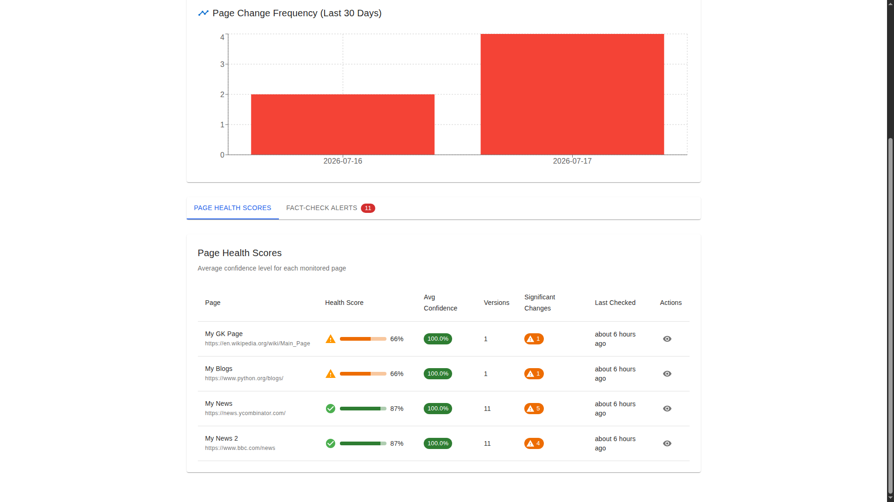

# FreshLense

### Cloud-Native AI Content Intelligence Platform

Production-ready web content monitoring platform featuring semantic change detection, AI-powered fact verification, end-to-end CI/CD, Prometheus monitoring, Grafana dashboards, centralized logging with Loki, and automated containerized deployments.

## Highlights

- AI-powered content monitoring
- Semantic change detection
- Intelligent fact verification
- Multi-Factor Authentication (MFA)
- Dockerized microservice architecture
- GitHub Actions + Jenkins CI/CD
- Prometheus + Grafana Monitoring
- Loki + Promtail Centralized Logging
- Alertmanager Integration
- Production-ready deployment

## System Architecture

The following diagram illustrates the complete FreshLense 2.0 architecture, including the application stack, CI/CD pipeline, observability stack, centralized logging, and monitoring infrastructure.

<p align="center">
  
</p>


---

## Table of Contents

- [Overview](#overview)
- [Features](#features)
- [Technology Stack](#technology-stack)
- [System Architecture](#system-architecture)
- [CI/CD Pipeline](#cicd-pipeline)
- [Monitoring & Observability](#monitoring--observability)
- [Project Structure](#project-structure)
- [Installation](#installation)
- [Environment Variables](#environment-variables)
- [API Overview](#api-overview)
- [Screenshots](#screenshots)
- [Roadmap](#roadmap)
- [Author](#author)
- [License](#license)

---

## Overview

FreshLense is a production-ready AI-powered web content monitoring platform that continuously tracks websites for meaningful content changes, performs intelligent fact verification, maintains historical versions, and provides enterprise-grade observability through a complete DevOps monitoring stack.

Unlike traditional website monitoring tools that trigger alerts for every HTML modification, FreshLense analyses semantic content changes, helping users focus on updates that genuinely matter.

The project showcases a complete software engineering workflow, combining modern full-stack development with DevOps best practices, including automated CI/CD, containerization, centralized logging, metrics collection, visualization, and alerting.

---

## Features

- Intelligent web content monitoring
- Semantic change detection
- Automated version history
- AI-generated content summaries
- Fact verification engine
- Manual and scheduled crawling
- Analytics dashboard
- Multi-Factor Authentication (MFA)
- Email notification support
- RESTful API
- Dockerized deployment
- CI/CD using GitHub Actions & Jenkins
- Prometheus metrics
- Grafana dashboards
- Loki centralized logging
- Promtail log shipping
- Alertmanager integration
- Node Exporter system monitoring

---

## Technology Stack

### Frontend

- React
- TypeScript
- Axios

### Backend

- FastAPI
- Python
- BeautifulSoup
- Requests
- JWT Authentication

### Database

- MongoDB

### AI

- OpenAI API
- Semantic Content Analysis

### DevOps

- Docker
- Docker Compose
- GitHub Actions
- Jenkins
- Docker Hub

### Observability

- Prometheus
- Grafana
- Loki
- Promtail
- Alertmanager
- Node Exporter

---

# System Architecture

```text
                        ┌─────────────────────────────┐
                        │           User              │
                        └──────────────┬──────────────┘
                                       │
                                       ▼
                        ┌─────────────────────────────┐
                        │      React Frontend         │
                        └──────────────┬──────────────┘
                                       │ REST API
                                       ▼
                        ┌─────────────────────────────┐
                        │      FastAPI Backend        │
                        └───────┬───────────┬─────────┘
                                │           │
                                │           │
                                ▼           ▼
                     ┌───────────────┐  ┌───────────────┐
                     │   MongoDB     │  │ Web Crawler   │
                     └───────────────┘  └───────┬───────┘
                                                │
                                                ▼
                                         Target Websites

──────────────────────────────────────────────────────────────────────────────

               Prometheus ─────► Grafana Dashboards

Docker Logs ─► Promtail ─► Loki ─► Grafana Logs

GitHub ─► GitHub Actions ─► Docker Hub ─► Jenkins ─► Deployment
```

FreshLense follows a modern cloud-native architecture where the React frontend communicates with a FastAPI backend that manages authentication, content monitoring, versioning, analytics, and fact verification. Monitoring, centralized logging, and CI/CD are integrated as first-class components to provide production-grade observability and automated deployments.

---

# CI/CD Pipeline

FreshLense uses a fully automated Continuous Integration and Continuous Deployment (CI/CD) pipeline to ensure reliable, repeatable, and production-ready deployments.

```text
Developer
    │
    ▼
Git Commit
    │
    ▼
GitHub Repository
    │
    ▼
GitHub Actions (Continuous Integration)
    │
    ├── Checkout Repository
    ├── Build Backend Image
    ├── Build Frontend Image
    ├── Run Docker Build Validation
    └── Push Images to Docker Hub
    │
    ▼
Docker Hub
    │
    ▼
GitHub Webhook
    │
    ▼
Jenkins (Continuous Deployment)
    │
    ├── Pull Latest Images
    ├── Stop Existing Containers
    ├── Deploy Updated Containers
    ├── Run Health Checks
    └── Verify Deployment
    │
    ▼
Production Environment
```

### CI Tools

- GitHub Actions for Continuous Integration
- Docker Hub as the Container Registry
- Jenkins for Continuous Deployment
- GitHub Webhooks for automatic deployment triggers

Every code push automatically builds, validates, publishes, and deploys the latest application version with minimal manual intervention.

---

# Monitoring & Observability

FreshLense includes a production-grade observability stack for monitoring application health, infrastructure performance, logs, and deployment status.

## Monitoring Stack

| Component | Purpose |
|-----------|---------|
| Prometheus | Metrics collection |
| Grafana | Visualization & Dashboards |
| Loki | Centralized log storage |
| Promtail | Log collection |
| Alertmanager | Alert routing & notifications |
| Node Exporter | Host-level metrics |

## Custom Metrics

FreshLense exposes custom Prometheus metrics for crawler performance, including:

- Total Crawl Requests
- Successful Crawls
- Failed Crawls
- Crawl Duration Histogram

These metrics enable real-time monitoring of crawler health and performance through Grafana dashboards.

## Logging Pipeline

```text
Backend Logs
      │
      ▼
 Docker Containers
      │
      ▼
   Promtail
      │
      ▼
     Loki
      │
      ▼
   Grafana Logs
```

The monitoring stack provides complete visibility into application behaviour, system performance, and operational health.

---

# Project Structure

```text
FreshLense/
│
├── .github/                     # GitHub Actions workflows
│
├── backend/
│   ├── app/
│   │   ├── routers/             # API routes
│   │   ├── schemas/             # Pydantic schemas
│   │   ├── services/            # Business logic
│   │   ├── utils/               # Utility functions
│   │   ├── crawler.py
│   │   ├── database.py
│   │   ├── main.py
│   │   ├── metrics.py
│   │   ├── models.py
│   │   └── scheduler.py
│   │
│   ├── Dockerfile
│   ├── requirements.txt
│   └── requirements-prod.txt
│
├── frontend/
│   ├── public/
│   ├── src/
│   │   ├── components/
│   │   ├── contexts/
│   │   ├── hooks/
│   │   ├── pages/
│   │   ├── services/
│   │   ├── types/
│   │   ├── App.tsx
│   │   └── index.tsx
│   │
│   ├── Dockerfile
│   ├── Dockerfile.prod
│   ├── nginx.conf
│   └── package.json
│
├── chrome_extension/            # Browser extension
│
├── jenkins/                     # Jenkins configuration
│
├── monitoring/
│   ├── alertmanager/
│   │   └── alertmanager.yml
│   ├── grafana/
│   ├── loki/
│   │   └── loki-config.yml
│   ├── prometheus.yml
│   ├── promtail/
│   │   └── promtail-config.yml
│   └── rules/
│       └── alerts.yml
│
├── docker-compose.yaml
├── docker-compose.prod.yaml
├── Dockerfile.jenkins
├── Jenkinsfile
├── .env
├── .env.dev
├── README.md
└── LICENSE
```

FreshLense follows a modular architecture that separates the application, monitoring stack, deployment configuration, and browser extension into independent components. This organization improves maintainability, simplifies deployment, and allows each service to evolve independently.

---

# Installation

## Clone the Repository

```bash
git clone https://github.com/<your-username>/FreshLense.git

cd FreshLense
```

---

## Configure Environment Variables

Create the required environment file.

```bash
cp .env.example .env.dev
```

Update the required variables before starting the application.

---

## Start the Application

```bash
docker compose up --build
```

The following services will be available:

| Service | URL |
|---------|-----|
| Frontend | http://localhost |
| Backend API | http://localhost:8000 |
| Swagger UI | http://localhost:8000/docs |
| Prometheus | http://localhost:9090 |
| Grafana | http://localhost:3000 |
| Alertmanager | http://localhost:9093 |

---

## Stop the Application

```bash
docker compose down
```
---

# Environment Variables

The backend uses the following environment variables.

| Variable | Description |
|-----------|-------------|
| MONGO_URI | MongoDB connection string |
| OPENAI_API_KEY | OpenAI API Key |
| RESEND_API_KEY | Email notification service |
| REACT_APP_BACKEND_URL | Backend API URL |
| ALLOWED_ORIGINS | Allowed frontend origins |
| EMAIL_ENABLED | Enable email notifications |
| AI_SUMMARIES_ENABLED | Enable AI-generated summaries |

---

# API Overview

FreshLense exposes a RESTful API built with FastAPI for authentication, page management, crawling, fact verification, analytics, and monitoring.

| Category | Endpoint |
|-----------|----------|
| Authentication | `/auth/login` |
| Authentication | `/auth/register` |
| Authentication | `/auth/validate-token` |
| User | `/user/profile` |
| Pages | `/api/pages` |
| Crawling | `/api/crawl/{page_id}` |
| Fact Check | `/fact-check` |
| Analytics | `/analytics` |
| Health | `/health` |
| Metrics | `/metrics` |

Interactive API documentation is automatically generated by FastAPI.

```
http://localhost:8000/docs
```

Production deployments also expose the Swagger UI for testing and exploring available endpoints.

---

# 📸 Screenshots

## Dashboard

The central dashboard provides a real-time overview of monitored pages, detected changes, and quick actions for content monitoring.

<p align="center">
  
</p>

---

## Analytics

Track page health, monitoring trends, alerts, and historical content changes through the analytics dashboard.

<p align="center">
  
</p>

<p align="center">
  
</p>

---

## Fact Verification

AI-powered fact verification extracts claims, evaluates confidence, and provides verification results with supporting context.

<p align="center">
  
</p>

---

## Grafana Monitoring

Production monitoring powered by Prometheus and Grafana for application metrics, crawl statistics, and system observability.

<p align="center">
  
</p>

---

## Jenkins Deployment

Automated Continuous Deployment pipeline powered by Jenkins.

<p align="center">
  
</p>

---

## GitHub Actions CI

Continuous Integration automatically builds and validates the application on every push.

<p align="center">
  
</p>

---

## Prometheus Targets

Prometheus continuously monitors all infrastructure services and application endpoints.

<p align="center">
  
</p>

---

## Centralized Logging (Loki)

Loki and Promtail provide centralized log aggregation and exploration directly from Grafana.

<p align="center">
  
</p>

---

# Roadmap

## Completed

- [x] React Frontend
- [x] FastAPI Backend
- [x] MongoDB Integration
- [x] Intelligent Web Crawling
- [x] AI Content Summaries
- [x] Fact Verification
- [x] JWT Authentication
- [x] Multi-Factor Authentication (MFA)
- [x] Docker
- [x] Docker Compose
- [x] GitHub Actions CI
- [x] Jenkins CD
- [x] Docker Hub Integration
- [x] GitHub Webhooks
- [x] Container Health Checks
- [x] Prometheus Monitoring
- [x] Grafana Dashboards
- [x] Loki Centralized Logging
- [x] Promtail Log Collection
- [x] Alertmanager Integration
- [x] Node Exporter Monitoring
- [x] End-to-End CI/CD Pipeline
- [x] End-to-End Observability Stack

## Upcoming

- [ ] Complete professional project documentation
- [ ] Cloud deployment (AWS/GCP)
- [ ] Kubernetes deployment
- [ ] Helm Charts
- [ ] Terraform Infrastructure as Code
- [ ] Distributed crawling
- [ ] Multi-node monitoring

---

# Author

**Aditya Bawne**

Bachelor of Engineering (Information Technology)

Passionate about DevOps, Cloud Computing, Automation, Site Reliability Engineering, and AI-powered applications.

- GitHub: https://github.com/adibawne26
- LinkedIn: *https://www.linkedin.com/in/aditya-bawne/*

---

# License

This project is licensed under the MIT License.

See the LICENSE file for more information.

