# 🚀 FreshLense 2.0

<h3 align="center">AI-Powered Content Freshness Monitoring Platform</h3>
<p align="center">Production-Ready • Cloud-Native • Fully Containerized • CI/CD Automated • Observable</p>

<p align="center">


</p>

---

## 🌐 Live Demo

**Application:** https://app.freshlense.xyz

**API Documentation:** https://app.freshlense.xyz/api/docs

**Health Endpoint:** https://app.freshlense.xyz/api/health

---

## Overview

Most monitoring tools only tell you *if* a site is up. FreshLense tells you **what changed and why it matters**. It continuously crawls tracked websites, detects meaningful content changes, versions the history, and uses AI to summarize and fact-check what's new — surfaced through a real-time analytics dashboard.

Beyond the product itself, FreshLense is a full demonstration of production-grade software delivery: automated CI/CD, containerized deployment on AWS, and a complete observability stack (metrics, logs, and alerting).

**Use cases:** government notices, technical docs, research publications, product/API changelogs, regulatory updates, news.

---

## Architecture

```text
                    Developer
                        │
                        ▼
                Local Development
                        │
                        ▼
                Git Version Control
                        │
                        ▼
                GitHub Repository
                        │
                        ▼
      GitHub Actions (Continuous Integration)
        • Build
        • Test
        • Docker Image Creation
        • Push to Docker Hub
                        │
                        ▼
                   Docker Hub
                        │
                        ▼
        Jenkins (Continuous Deployment)
                        │
                        ▼
                  AWS EC2 Server
                        │
                        ▼
            Docker Compose Production
                        │
        ┌───────────────┼────────────────┐
        ▼               ▼                ▼
  React Frontend   FastAPI Backend   MongoDB Atlas
                        │
                        ▼
              Nginx Reverse Proxy
                        │
                        ▼
            HTTPS (Let's Encrypt SSL)
                        │
                        ▼
            https://app.freshlense.xyz

──────────────────────────────────────────────────────

          Production Observability Stack

FastAPI Metrics
        │
        ▼
  Prometheus
        │
        ▼
    Grafana Dashboards

Docker Logs
        │
        ▼
   Promtail
        │
        ▼
      Loki
        │
        ▼
    Grafana Logs

Prometheus Alerts
        │
        ▼
  Alertmanager
        │
        ▼
 Email Notifications

Node Exporter
        │
        ▼
Infrastructure Metrics
        │
        ▼
    Prometheus
```

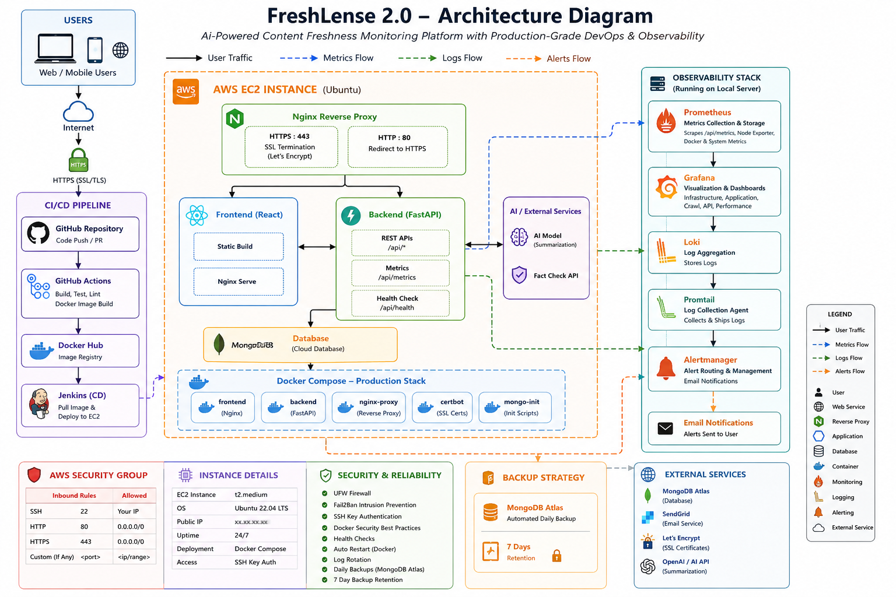

---

## Tech Stack

| Layer | Technologies |
|---|---|
| Frontend | React, TypeScript |
| Backend | Python 3.11, FastAPI, Uvicorn, APScheduler |
| Database | MongoDB Atlas |
| Auth | JWT, MFA (email OTP), Passlib/Bcrypt |
| AI / Content | OpenAI API, SERP API, BeautifulSoup4, lxml |
| Containers & Orchestration | Docker, Docker Compose |
| CI/CD | GitHub Actions, Jenkins, Docker Hub |
| Infrastructure | AWS EC2, Nginx, Let's Encrypt |
| Observability | Prometheus, Grafana, Loki, Promtail, Alertmanager, Node Exporter |
| Infra Security | UFW, Fail2Ban, SSH key auth |
| Email | Resend API / SMTP |

---

## Features

**Content Monitoring** — continuous crawling, version history, configurable schedules, multi-site tracking.

**AI Intelligence** — change summaries, significance scoring, automated fact-checking, semantic diffing.

**Dashboard** — live monitoring status, freshness insights, crawl analytics, historical trends.

**Auth & Security** — JWT sessions, MFA, email verification, password reset, audit logging.

---

## CI/CD Pipeline

1. Push to `main` → **GitHub Actions** builds frontend/backend, runs tests, builds and pushes Docker images to Docker Hub.
2. Webhook triggers **Jenkins**, which SSHs into the EC2 host, pulls the latest images, and recreates containers via Docker Compose.
3. Container health is verified and unused images are pruned automatically.

Zero manual steps from `git push` to production.

## 🚀 CI/CD Workflow

```text
                        Developer
                            │
                    git push origin main
                            │
                            ▼
                    GitHub Repository
                            │
                            ▼
            GitHub Actions (Continuous Integration)
            ├── Checkout Source Code
            ├── Build React Frontend
            ├── Build FastAPI Backend
            ├── Build Docker Images
            ├── Push Images to Docker Hub
            └── Verify Build Success
                            │
                            ▼
                        Docker Hub
                            │
                  GitHub Webhook Trigger
                            │
                            ▼
             Jenkins (Continuous Deployment)
                            │
                SSH Deployment to AWS EC2
                            │
                            ▼
                  Production Server (EC2)
             ├── Pull Latest Docker Images
             ├── Recreate Containers
             ├── Verify Container Health
             ├── Remove Unused Docker Images
             └── Confirm Successful Deployment
                            │
                            ▼
                Nginx Reverse Proxy + HTTPS
                            │
                            ▼
                https://app.freshlense.xyz
```
---

## Monitoring & Alerting

- Prometheus scrapes custom FastAPI metrics (requests, latency, status codes, crawl duration/count) and Node Exporter host metrics; Grafana visualizes them across dedicated dashboards (infra health, API performance, crawl analytics).
- Loki + Promtail centralize container logs for search in Grafana Explore. Alertmanager emails on: backend down, high CPU/memory, low disk, exporter/Prometheus/Loki/Alertmanager down, and container restarts — all validated in production.

## 📈 Observability Architecture

```text
                FreshLense Production
        ┌──────────┬──────────┬──────────┐
        │          │          │          │
        ▼          ▼          ▼          ▼
    Frontend    Backend    MongoDB   EC2 Host
                    │                    │
                    ▼                    ▼
        Custom Metrics         Node Exporter
                    │
                    ▼
              Prometheus
                    │
          ┌─────────┴─────────┐
          ▼                   ▼
      Grafana           Alertmanager
                              │
                              ▼
                     Email Notifications

────────────────────────────────────────────

Application Logs
        │
        ▼
    Promtail
        │
        ▼
      Loki
        │
        ▼
    Grafana Explore
```

---

## Security

- JWT auth + MFA + bcrypt password hashing
- HTTPS via Let's Encrypt, Nginx reverse proxy
- AWS Security Groups, UFW firewall, Fail2Ban
- SSH key-based, password-less deployments
- Docker container isolation, least-privilege deploy access
- Daily automated MongoDB backups, 7-day retention

---

## Project Structure

```
FreshLense/
├── backend/          # FastAPI app, routers, services, models, middleware
├── frontend/         # React app, components, pages, hooks
├── monitoring/        # Prometheus, Grafana, Loki, Promtail, Alertmanager configs
├── docs/              # Architecture, deployment, security, troubleshooting docs
├── .github/workflows/ # CI pipeline
├── Jenkinsfile         # CD pipeline
└── docker-compose*.yaml # dev / prod / EC2 configs
```

---

## Quick Start

**Prerequisites:** Git, Docker 24+, Docker Compose v2+ (Node 20+ / Python 3.11+ optional for local dev)

```bash
git clone https://github.com/adibawne26/FreshLense.git
cd FreshLense
```

Create a `.env` file:

```env
MONGO_URI=mongodb://mongodb:27017/freshlense
OPENAI_API_KEY=your_openai_api_key
RESEND_API_KEY=your_resend_api_key
SERPAPI_API_KEY=your_serpapi_key
```

Run:

```bash
docker compose up --build -d
```

| Service | URL |
|---|---|
| Frontend | http://localhost |
| Backend API | http://localhost:8000 |
| API Docs | http://localhost:8000/docs |

Stop: `docker compose down` (add `-v` to remove volumes)

### Local Development (without Docker)

```bash
# Backend
cd backend && python -m venv venv && source venv/bin/activate
pip install -r requirements.txt
uvicorn app.main:app --reload

# Frontend
cd frontend && npm install && npm start
```

Tests: `pytest` (backend) · `npm test` (frontend)

---

## API Reference

Full docs at `/docs` (Swagger) and `/redoc`.

| Method | Endpoint | Description |
|---|---|---|
| POST | `/api/auth/register` | Register user |
| POST | `/api/auth/login` | Login |
| POST | `/api/auth/verify-mfa` | Verify MFA |
| POST | `/api/auth/forgot-password` | Request password reset |
| POST | `/api/auth/reset-password` | Reset password |
| GET | `/api/auth/profile` | User profile |
| GET | `/api/pages` | List monitored pages |
| POST | `/api/pages` | Add website |
| PUT | `/api/pages/{id}` | Update page |
| DELETE | `/api/pages/{id}` | Delete page |
| POST | `/api/pages/{id}/check` | Trigger manual scan |
| GET | `/api/analytics/dashboard` | Dashboard metrics |
| GET | `/api/analytics/history` | Historical analytics |
| GET | `/api/analytics/changes` | Change analytics |
| GET | `/api/versions/{page_id}` | Version history |
| GET | `/api/changes/{page_id}` | Detected changes |
| GET | `/api/history/{page_id}` | Complete history |
| GET | `/health` | Health check |
| GET | `/metrics` | Prometheus metrics |

**Example response:**
```json
{
  "status": "success",
  "page_id": "64a8f91e2b...",
  "changes_detected": true,
  "freshness_score": 92,
  "summary": "Content updated with new release notes."
}
```

---

## Screenshots

| | |
|---|---|
| Dashboard | 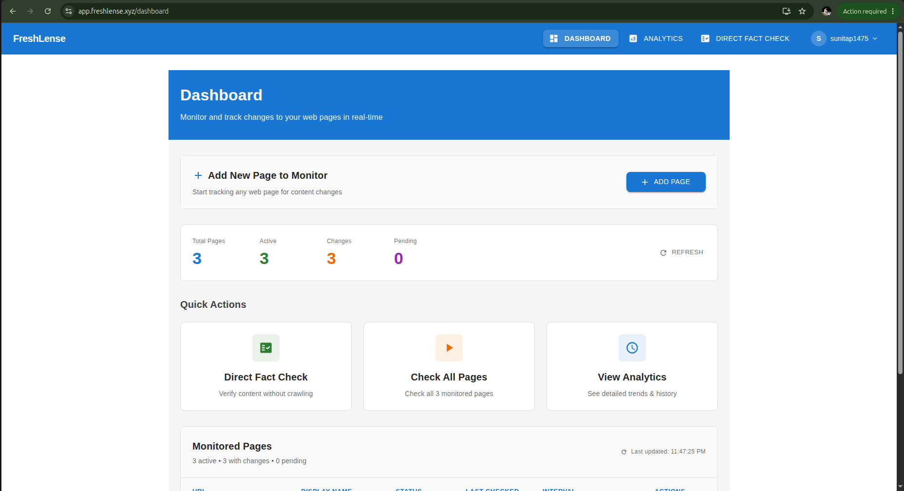 |
| Page Management | 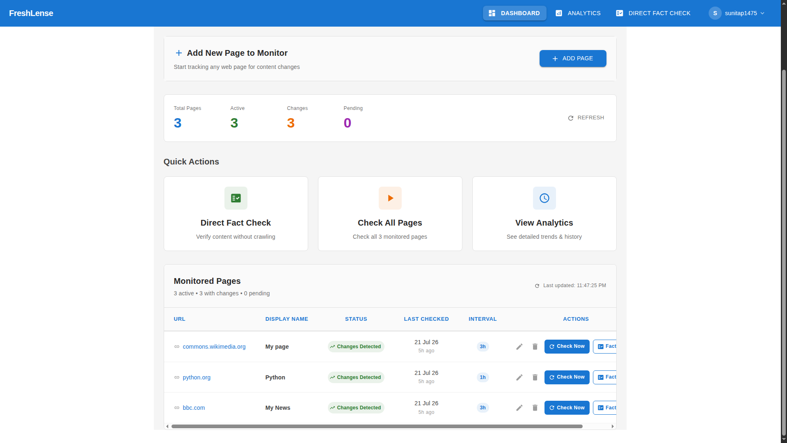 |
| Analytics | 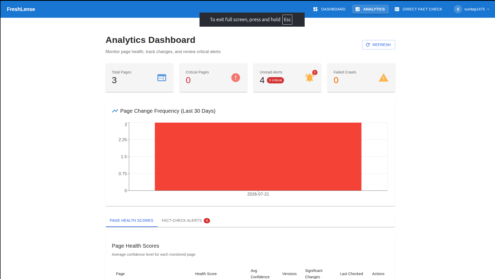 |
| Analytics Score | 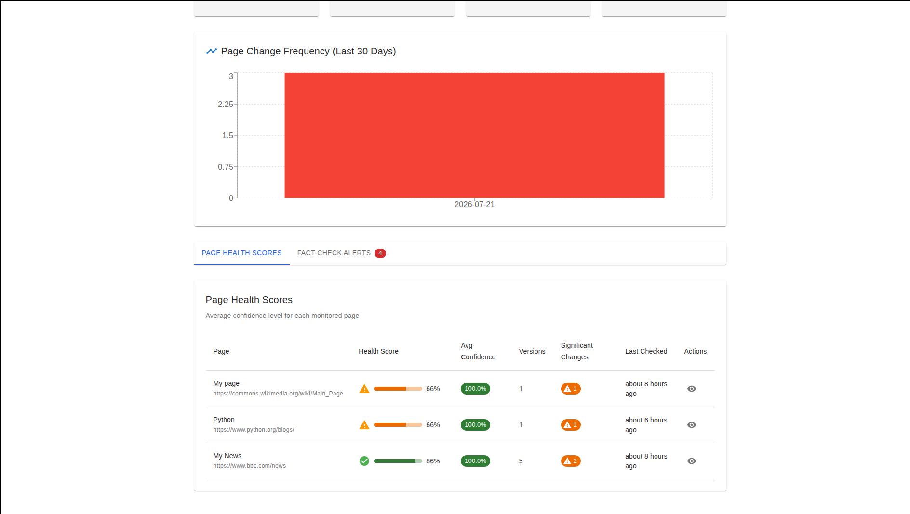 |
| AI Fact Checking | 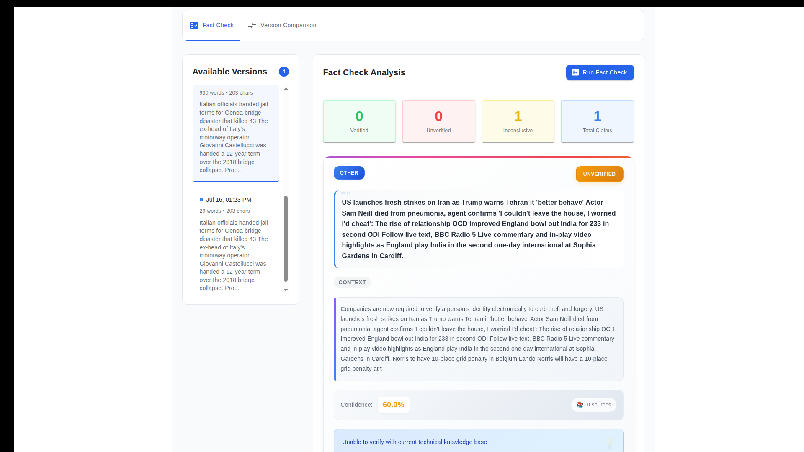 |
| CI (GitHub Actions) | 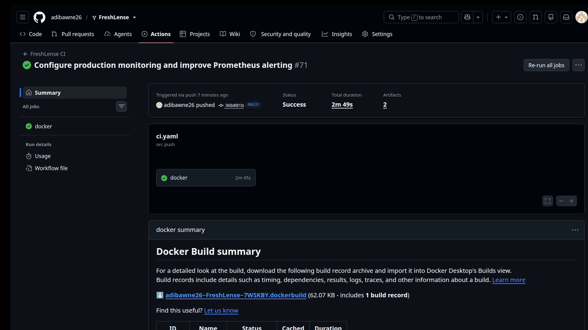 |
| CD (Jenkins) | 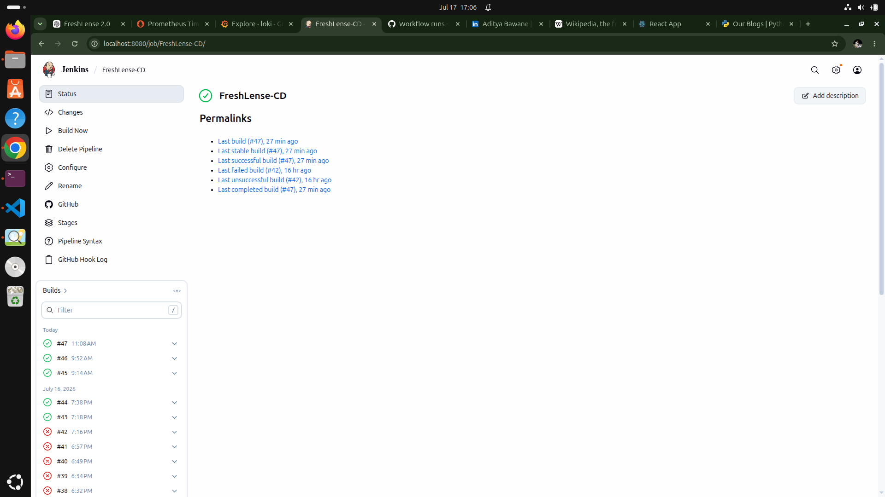 |
| AWS EC2 | 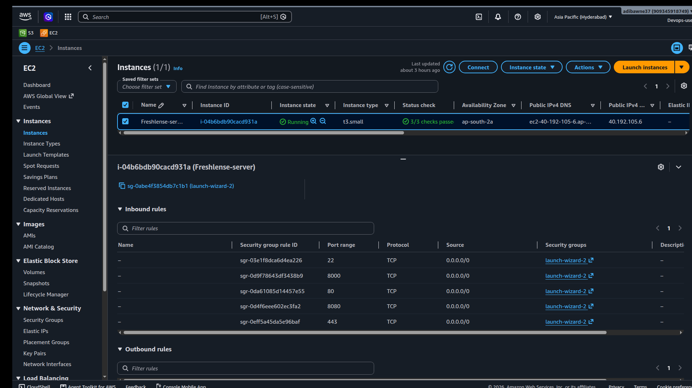 |
| AWS Security Groups | 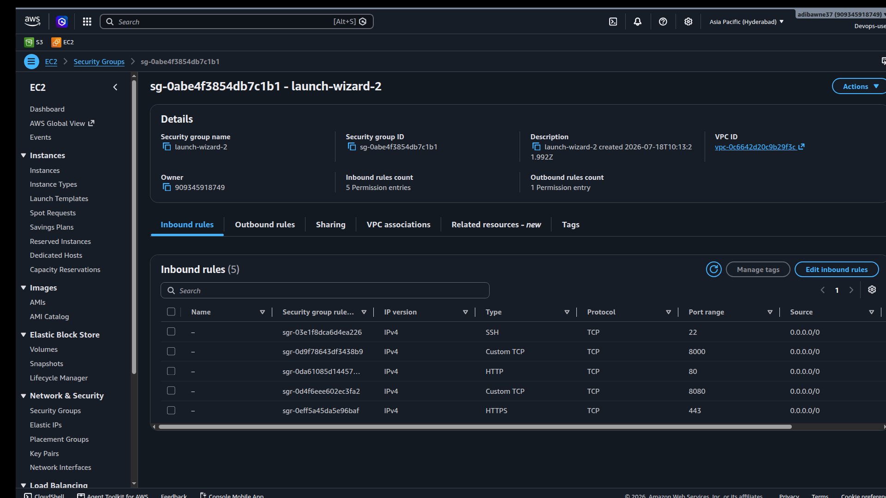 |
| Prometheus Targets | 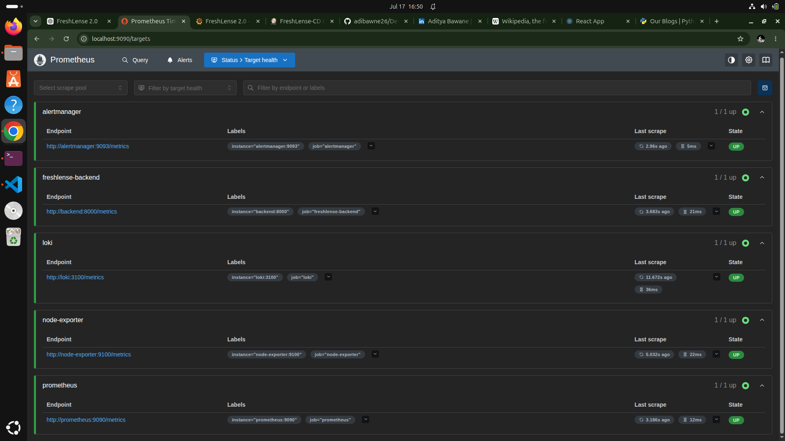 |
| Grafana Dashboards | 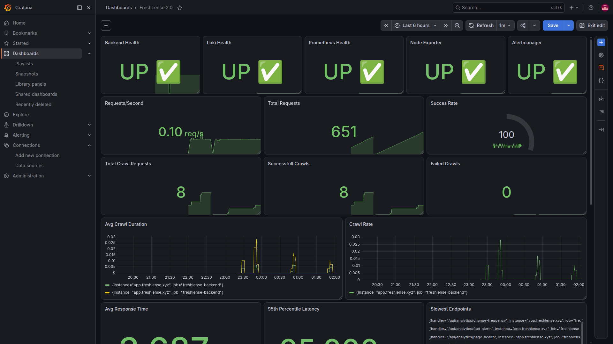 |
| Grafana Dashboards | 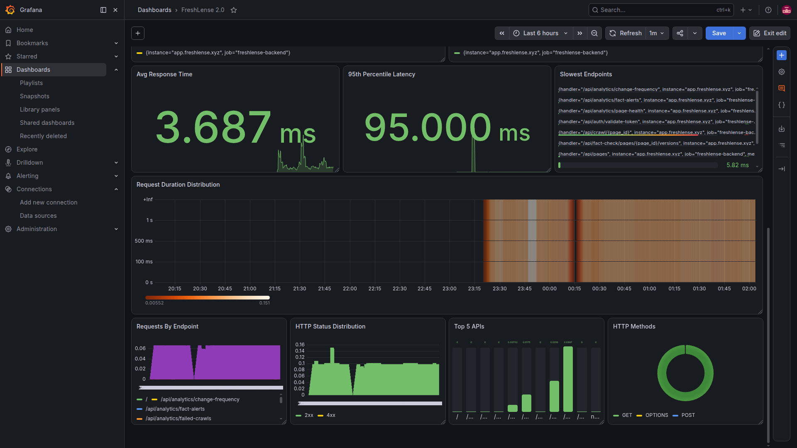 |
| Grafana Explore (Loki) | 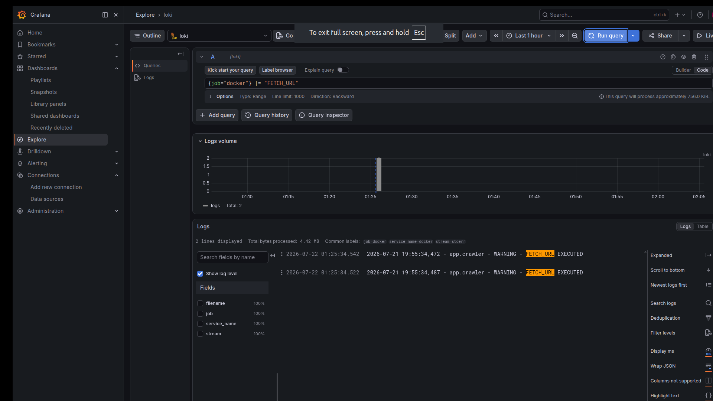 |
| Alertmanager | 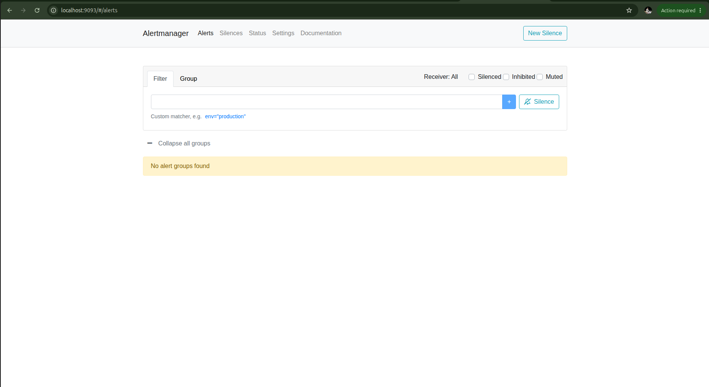 |
| Email Alert | 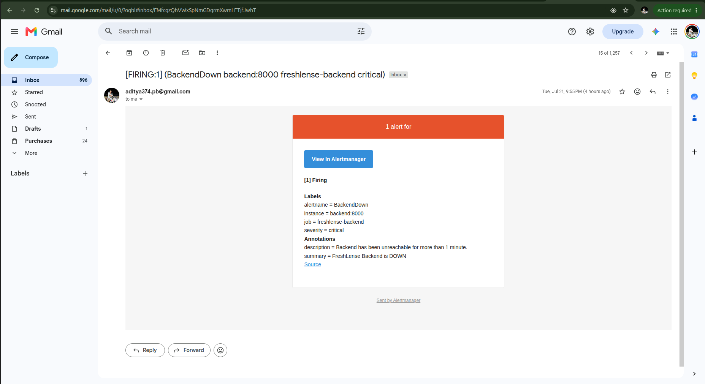 |
| Docker Containers (EC2) | 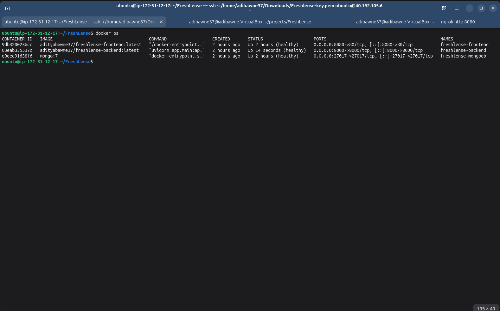 |
| Docker Containers (Local) | 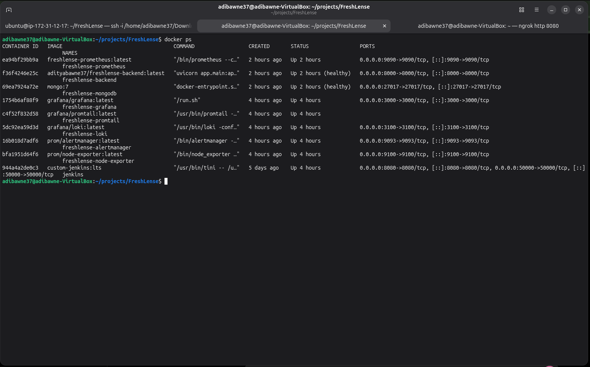 |

---

## Contributing

1. Fork the repo and create a feature branch: `git checkout -b feature/your-feature`
2. Make your changes, keeping commits small and meaningful
3. `git commit -m "feat: add awesome feature"`
4. `git push origin feature/your-feature`
5. Open a Pull Request

Please ensure the app builds cleanly and update docs where relevant. For bugs, open an issue with repro steps, expected behavior, and environment details.

---

## Author

**Aditya Bawane** — DevOps · Cloud · SRE · Backend Development

- GitHub: https://github.com/adibawne26
- LinkedIn: https://www.linkedin.com/in/aditya-bawane37/
- Email: aditya374.pb@gmail.com

---

## License

MIT — see [LICENSE](LICENSE).

⭐ If this project is useful, consider starring the repo.